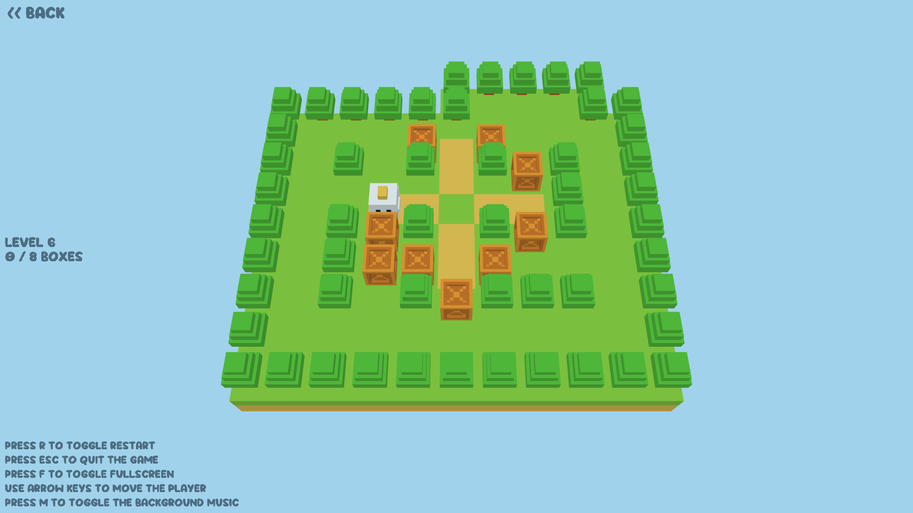

A simple puzzle game inspired by Sokoban.



Build and run:
```bash
# For web
# Install emscripten: https://emscripten.org/docs/getting_started/downloads.html
emcmake cmake -B build-web -DPLATFORM=Web -DCMAKE_BUILD_TYPE=Release
cd build-web && make && cd chickoban
sudo npm install -g live-server
live-server --entry-file=chickoban.html

# For desktop
cmake -B build -DCMAKE_BUILD_TYPE=Release
cd build && make && cd chickoban
./chickoban
```

Credits:
- Levels from [here](https://sokoban.dk/levels/levels-the-download-page/)
- 3D models from [here](https://sona-sar.itch.io/voxel-animals-items-pack-free-assets)
- Font from [here](https://www.fontspace.com/super-playful-font-f118059)
- Background music from [here](https://silentswimmer.itch.io/toymaker)
- Sound effects from [here](https://opengameart.org/content/12-player-movement-sfx)
  and [here](https://pixabay.com/sound-effects/search/pop/)

I made this just for fun, hope you enjoy :)
